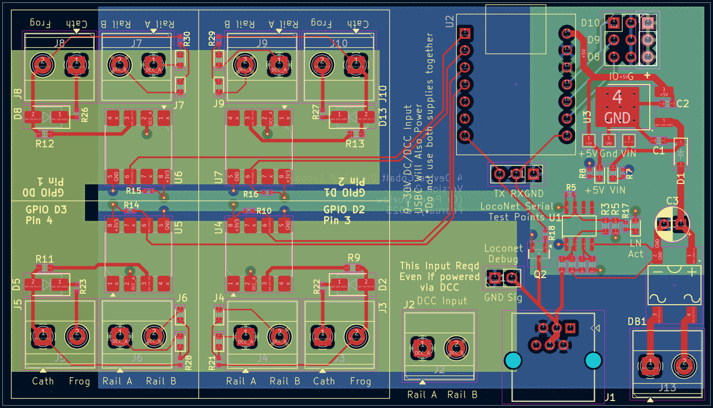

# Cobalt Digigal IP turnout control state announcer
The goal of this project is to provide a simple mechanism to report the realtime state of a Cobal Digital IP turnout control motor to loconet. For brevity, Cobalt Digital IP is reduced to CDIP in my work.

## Design
The Cobalt motor is really nice, it's a self contained DCC design and is reasonably robust. Not the quietest, but it works, and it works well with Digitrax and JMRI. However, because it's DCC only, JMRI has no mechanism for requesting state from the motor. This means, at startup, or if something outside of Loconet changes the turnout state, JMRI does not know that it happened. I like it when I see my layout in JMRI in the correct state. I have a 4 turnout cross over and two turnouts which gate reverse loops which are automated

So, basically, I chose this as a low impact HW/SW project I could do to solve the problem. I'm learning how to do HW as a long term software engineer by trade, and enjoy doing small projects with MCU's. This may not be very useful to very many people, but it's fun and I'm looking forward to using it on my layout which has about 30 turnouts in a 19'x19' snaking layout.

This will not do loconet forwarding, and you can't daisy chain. I started to think for the cost, it's pry just smarter to use a UP7 without the faceplate which gives you 4 reliable ports for ~16USD. While adding the HW here would have been cheaper, the cost and complexity made it less interesting to me. I may put it back in later as I get better a loconet circuitry. I removed the daisy chain option, even though that's effectively free, as you can't infinitely chain non boosted devices together, and I didn't want to keep track of how many were connected.

This design makes use of Seeed Studio XIAO modules. I love these things. They are pretty cheap overall, tiny, and you can swap different modules on the same carrier. So, my design uses the Pico MCU because I don't want to include WiFi in my design. My basement layout is pretty far from the nearest router, and I don't want to suck up a lot of the router's attention for these when turned on. However, without changing the hardware, or changing the board size, anyone could use the ESP32 if they choose to. The benefit there might be MQTT and adding a webserver to assign DCC addresses without recompiling the firmware.

While not yet coded up, my mechanism for knowing when to send a startup message will be based on the first Loconet traffic the board sees. As this can be DCC powered, it can also be DC powered, so triggering on when we start to see traffic would be the most beneficial in all cases.

## Requirements
* Provide Loconet messages for turnout state changes as they happen
* Provide a loconet message indicating turnout state on DCC power up
* Handle four turnouts on one board
* Run with either an ESP32 or RPi Pico
* Not require more than 8 GPIO (this one currently only uses 4)
* Wide input voltage range
* Allow for direct connection of indicator LEDs for the turnout.
** This allows to wire up signals as an example, without the need for extra diodes/resistors along the wire run.

### What it doesn't currently do
* Will not switch the turnout via a Loconet message
* Does not have a second Loconet port for daisy chain

## KiCad design
This is a work in progress. What I've got posted now is version 2, not yet ordered.

I built a first board based solely on a few simple schematic facts hoping they all sort of would just work. This did allow me to test the GPIO portion of the design and validate my assumptions were correct. However, version 1, which is not in git unforunately, did not work for Loconet traffic. I don't know why, but I did make a mistake in the pin assigments for the second Serial port on the XIAO Pico module. I did jumper it, but it still doesn't work. I also didn't add test points, so it's not possible for me at home to use a scope to figure out what's going on. All of those facts are fixed in the current version.

Recently, I also added the ability to use DCC for power. However, I couldn't find a way to combine the two DCC connectors at that point, so you always need a DCC input for the IO, but if you want to power via DCC, then you simply plug a DCC bus into the power connection. For this reason, that connection is no longer polarized, and it doesn't matter which way you wire it.

I also added 3 pins connected to D8, D9, and D10 in Arduino land. They have both Ground and Power pins to go with, so you can use them however you feel the urge. I would limit any GPIO access to 30ma total though, as you have 500ma from the board, but roughly 200ma is already consumed.

## Notes
* The orientation of the DCC inputs into the Digital IP does matter. I assume for this device that DCC Rail A as labeled coming out of a Digitrax command station is the outer most pin 1 in the diagram below. If you reverse and put DCC Rail B into that slot, you either have to reverse Rail A and B inputs for the DCC Input terminal or update the code to account for the direction messages being backwards. Note, if you reverse using DCC address 197, you must also reverse the direction. This can be done by setting the CDIP inverted boolean to true.

* This is DC only, but takes up to 30V as input. The reason for this is that I have a 15V DC power bus running with the DCC bus to power some of the Digitrax devices in use (mostly PM74's). For the length of those conductors, even at 16Ga, you get some voltage drop and this should allow the boards to not worry about that.

